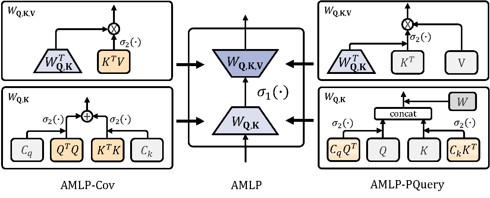
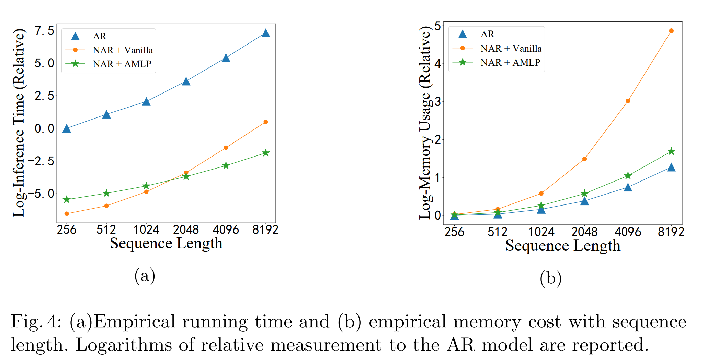

# AttentiveMLP
Official codebase for 2023 ECML-PKDD "Attentive Multi-Layer Perceptron for Non-autoregressive Generation"


<p align = "center">

</p>
<p align = "center">
The computation process of two variants of AMLP.
</p>

## Highlights
* Our proposed **AMLP** as an efficient attention which can be applied in both self-attention and cross-attention for non-autoregressive (NAR) models.
* **AMLP** is a powerful attention even compared to softmax attention, while maintaining linear complexity

Our study achieves promising achievements in terms of efficiency by speeding up the computation process of NAR.

<p align = "center">

</p>

## Setup & Datasets
The code is based on PyTorch and `fairseq` and [CAB](https://github.com/Shark-NLP/CAB)

* For text-to-speech, super resolution and long sequence time-series forecasting, we follow [CAB](https://github.com/Shark-NLP/CAB) to conduct the main experiments. So please follow them to set up the main environment as well as datasets.
* For machine translation, we use the open-sourced code base [CMLMC](https://github.com/layer6ai-labs/CMLMC). Please follow the setup scripts.

## Training

* For text-to-speech, super resolution and long sequence time-serires forcasting, please follow [CAB](https://github.com/Shark-NLP/CAB) and replace the softmax attention with our `AMLPCov` in `amlp.py`.
* For machine translation, please use the following script:

```bash
DATA_DIR="DISTILLED_DATA_DIR"
SAVE_DIR="CHECKPOINT_SAVE_DIR"
CKPT_NAME="CKPT_NAME"
ATTN_TYPE="amlpquery"
VISIBLE_GPUS="0,1,2,3"
# train
CUDA_VISIBLE_DEVICES=$VISIBLE_GPUS python train.py $DATA_DIR \
   --arch cmlm_transformer_wmt_en_de \
   -s de \
   -t en \
   --optimizer adam \
   --adam-betas '(0.9,0.98)' \
   --criterion nat_loss \
   --task translation_lev \
   --label-smoothing 0.1 \
   --noise random_mask \
   --lr-scheduler inverse_sqrt \
   --warmup-init-lr '1e-07' \
   --lr 0.0005 \
   --warmup-updates 40000 \
   --dropout 0.2 \
   --weight-decay 0.01 \
   --decoder-learned-pos \
   --encoder-learned-pos \
   --apply-bert-init \
   --share-all-embeddings \
   --max-tokens 16384 \
   --max-update 300000 \
   --fixed-validation-seed 7 \
   --log-interval 100 \
   --fp16 \
   --keep-last-epochs 20 \
   --eval-bleu --eval-bleu-args '{"iter_decode_max_iter": 0, "iter_decode_with_beam": 1}' \
    --eval-tokenized-bleu --eval-bleu-remove-bpe \
   --landmarks 16 \
   --insertCausalSelfAttn \
   --amlp-activation 'softmax' \
   --encoder-self-attention-type 'mha' \
   --decoder-cross-attention-type $ATTN_TYPE \
   --decoder-self-attention-type $ATTN_TYPE \
   --no-scale-embedding \
   --concatPE \
   --add_ema 0.99 \
   --selfcorrection 0 \
   --replacefactor 0.3 \
   --save-dir $SAVE_DIR/$CKPT_NAME

# test
python InferenceWMT_valid.py $CKPT_NAME 132 151 $SAVE_DIR/BLEU/  $DATA_DIR
```

Here we use two distilled datasets `WMT 14 EN-DE` and `WMT 14 DE-EN`.

Special Arguments explanation:

* `--landmarks`: the $c$ value in AMLP.
* `--amlp-activation`: the activation function of AMLP. Default to be softmax.
* `--decoder-{self, cross}-attention-type`: the type of attention used in experiments. We did not use `amlpcov` because `amlpcov` lags behind `amlpquery` in cross attention, which is not appropriate for generation task.

The number of GPU devices can be changed, but the max tokens should be 64k via the formula: `update_freq * GPU_devices * max-tokens`, where `--update-freq` defaults to 1.

